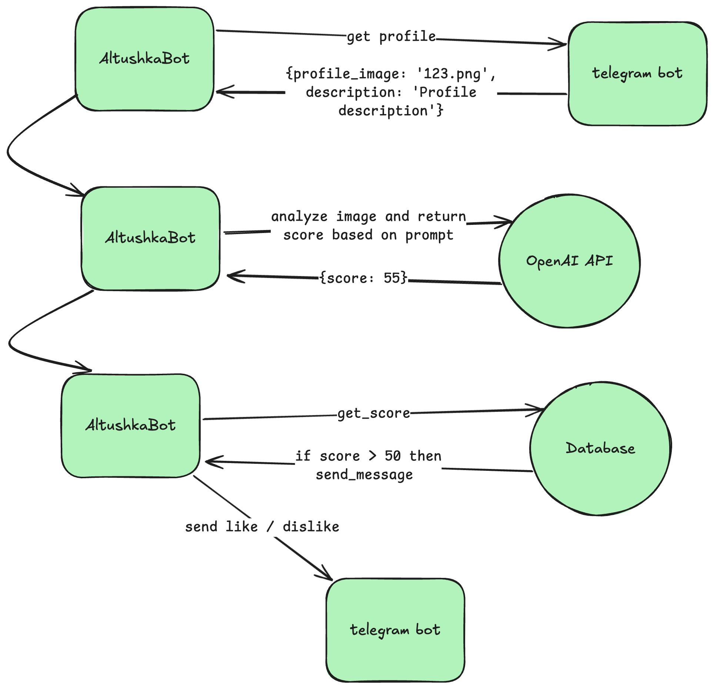

## Altushka Bot

Altushka Bot подключается к вашему аккаунту Telegram с использованием TDLib API и использует Dayvinchik Bot для анализа
изображений профиля, помогая находить альтушка-профили.

### Как это работает (я мог чет забыть, мне лень писать фул сетап, сами разбирайтесь)

- **Установка TDLib:**  
  Установите TDLib и убедитесь, что путь к нему правильно указан в файле `build.rs`.

- **Аутентификация:**  
  При первом запуске может потребоваться аутентификация через QR-код (см. функцию `qr_auth_init`).

- **Настройка:**
    - Укажите учетные данные вашего аккаунта Telegram в переменных окружения.
    - Предоставьте токен OpenAI для доступа к API.

- **Запуск бота:**  
  Выполните команду `cargo run` для старта бота.

- **Работа бота:**
    - Бот устанавливает связь с Dayvinchik Bot.
    - Он получает первое фото профиля и сохраняет его.
    - Рабочий процесс отправляет это изображение в OpenAI API, который анализирует его на предмет альтернативного стиля
      и возвращает оценку.
    - Работник по обзору профилей анализирует оценку и, исходя из результата, отправляет лайк или дизлайк. Пока сделал
      так, что отправляет суперлайк с подготовленным текстом, чтобы конверсия выше была
    - Различные акторы с уникальными подсказками и поведением обеспечивают разнообразное взаимодействие в зависимости от
      выбора пользователя.

### Экспериментальные функции (*НЕСТАБИЛЬНЫЕ*)

- Сохраняет векторные представления всех просмотренных изображений в базе данных pg_vector.
- Включает чат-ответчик, который отслеживает неотвеченные чаты и отправляет ответы.
- Функция анализа совпадений, анализирующая и сохраняющая профили совпадений.

### Архитектура

### Функции в разработке

- Получение описания профиля и создание "special_message" с использованием LLM.
- Разработка обучающего инструмента для улучшения модели, создания персонализированного механизма подбора.

## Altushka Bot

Altushka Bot connects to your Telegram account using the TDLib API and leverages the Dayvinchik Bot to analyze profile
images and help you find emo profiles.

### How It Works

- **Setup TDLib:**  
  Install TDLib and ensure its path is correctly set in `build.rs`.

- **Authentication:**  
  On the first run, you may need to authenticate via QR code (see the `qr_auth_init` function).

- **Configuration:**
    - Set your Telegram account credentials in the environment variables.
    - Provide your OpenAI token to enable API access.

- **Running the Bot:**  
  Execute `cargo run` to start the bot.

- **Bot Operations:**
    - The bot initiates communication with the Dayvinchik Bot.
    - It retrieves the first profile picture and saves it.
    - A worker sends this image to the OpenAI API, which analyzes it for an alternative style and returns a score.
    - A profile reviewer worker then evaluates the score and sends a like or dislike accordingly.
    - Different actors with unique prompts and behaviors handle various interactions, allowing for varied responses
      based on user choices.

### Flag Features (*UNSTABLE*)

- Stores vectors of all reviewed images in a pg_vector database.
- Includes a chat responder that monitors unanswered chats and sends responses.
- Features a match analyzer that reviews and stores profiles of matches.

### Architecture

### Features in Progress

- Generating profile descriptions and constructing a "special_message" using an LLM.
- Developing a learning tool to educate the model, creating a personalized matching engine.
